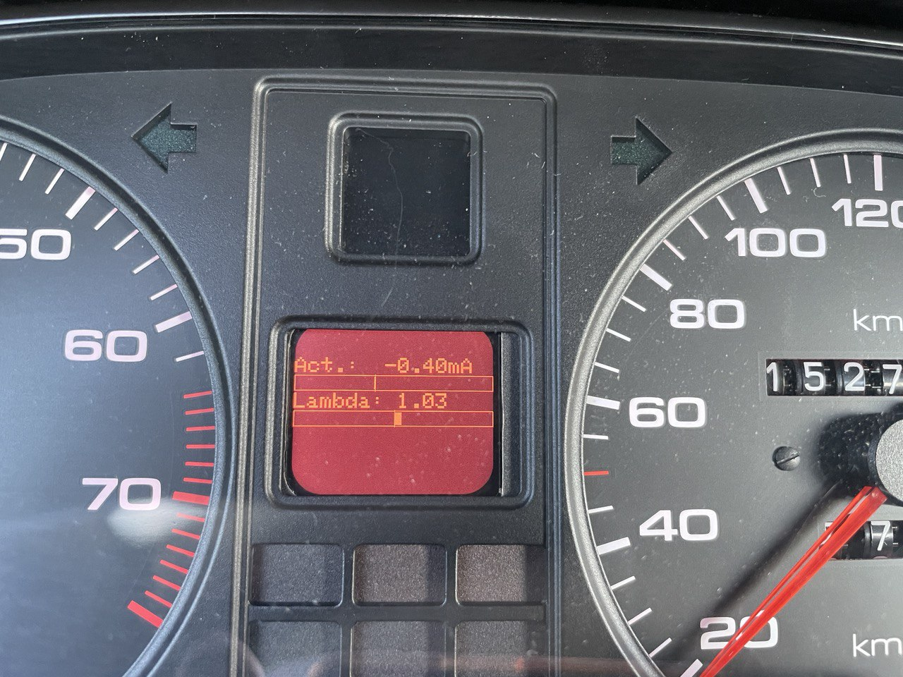

# ESP8266-CurrentDiagReceiver
ESP8266 (Wemos D1 mini) based Receiver of 

Measure the current of the electro-hydraulic pressure regulator of a KE-Jetronic, the lamda value and speed.

Receiving data via UDP.

